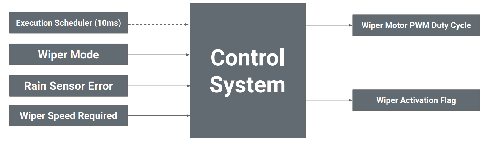
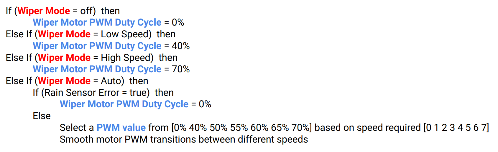
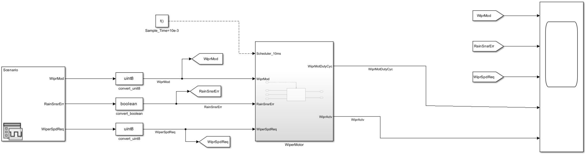
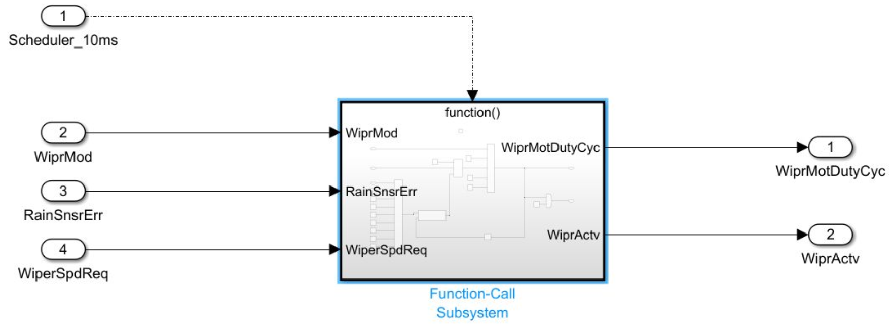
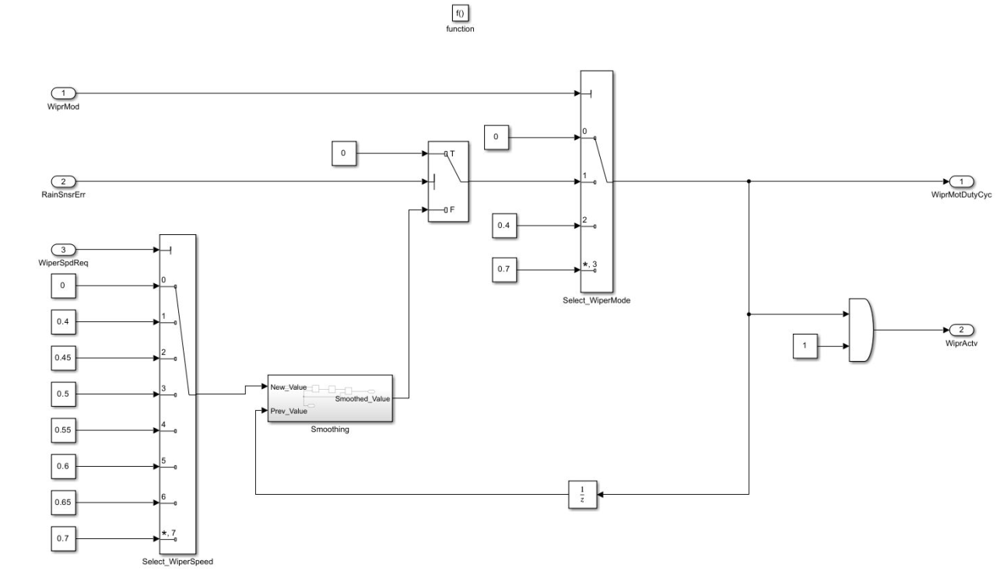
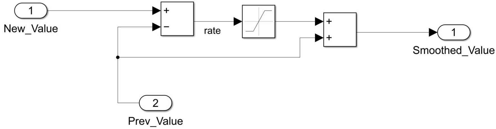
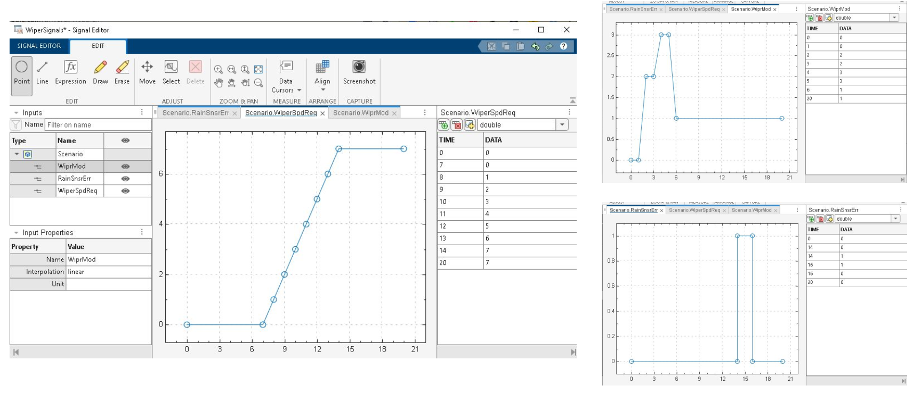
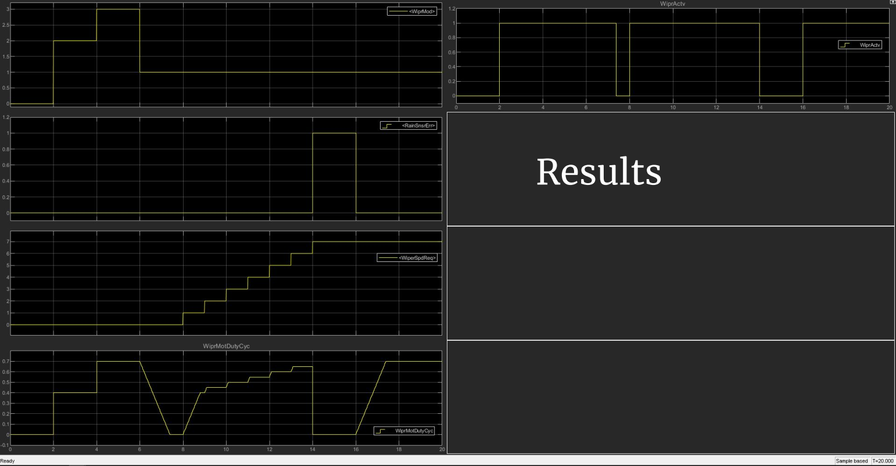

# Vehicle Wiper control system using Simulink

## Project Requirements: Root Level

## Project Requirements: control system logic

## Simulink System Modelling: Root level

## Wiper Motor Subsystem

## Wiper Motor Subsystem : Modelling the logic

## Wiper Motor Subsystem : Automatic Signal Smoothing by Rate limiter

## Model Testing: Creating Input signals scenario using Signal Editor

 

